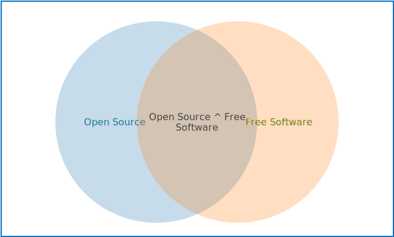

[[<<PREVIOUS: Table of Contents]](index) -
[[NEXT: Cloning and collaborating>>]](practicalexercises/github/git-02-cloning-and-collaborating)

# What is open source?

  _what do you think open source means?_

## Some of the things open source isn't

### Open source isn't just any code shared on the internet.
Code on GitHub (or anywhere public) without a licence is actually copyrighted and can't be re-used. The only way to make your code open source is to explicitly add a licence, or potentially to upload it to a site that automatically provides an open licence (example: figshare does this).

### Open source isn't free software

Sometimes open source software is free (as in it doesn't cost you money to use), and sometimes free software is open source, but they are not the same thing.

## So what _is_ open source?

Open Source is simply sharing the design for your work so it can be re-used and re-mixed by others.

### Open access vs data vs source.

Time for a bit of disambiguation.

- **Open access** usually refers to _papers_ that aren't paywalled by publishers.
- **Open data** refers to the practice of sharing the data that produces your results. This is especially important if you write code that depends in the data - the code can't usually be re-run without it.
- **Open source** shared design for your work that can be re-used by others, often computer code or hardware designs.

## Open source glossary

Here are some popular terms that may crop up when talking about open source.

- "free as in beer" vs "free as in speech": some software is free like beer (doesn't cost money) and some software is free like speech (no-one can tell you what to do with the software).  Some are both, or neither.
- Copyleft: coined as an opposite of copyright, copyleft is the concept that software _must_ remain free (open) according to its licence terms.
- FLOSS or F/LOSS: Free / Libre Open Source software.

### Why open source?
- Hacker ethic - nobody should have to reinvent the wheel. If you have benefitted from other’s work, you should give back to the community
- Distributed collaborative innovation: share your work, and others will share back
- Open source makes interdisciplinarity easier
- Decentralisation, appropriation and customisation
- Document for others and for you: If you include documentation to help others set it up, it’ll be easier for you to come back to the project when you’ve forgotten what you did.

## Licencing

There are lots of open source licences out there. Most are pretty good. Use one!
Some allow users of the code to do anything they like with their code - these are known as permissive licences. Examples are the [MIT Licence](https://tldrlegal.com/license/mit-license) or [Apache](https://tldrlegal.com/license/apache-license-2.0-(apache-2.0)).

Here are some ways to help you choose:

- [https://choosealicense.com/](https://choosealicense.com/) - does what it says on the tin and helps you choose a licence.
- [https://tldrlegal.com/](https://tldrlegal.com/) - plain english explanations of licences in bullet form.

[[<<PREVIOUS: Table of Contents]](index) -
[[NEXT: Cloning and collaborating>>]](practicalexercises/github/git-02-cloning-and-collaborating)
